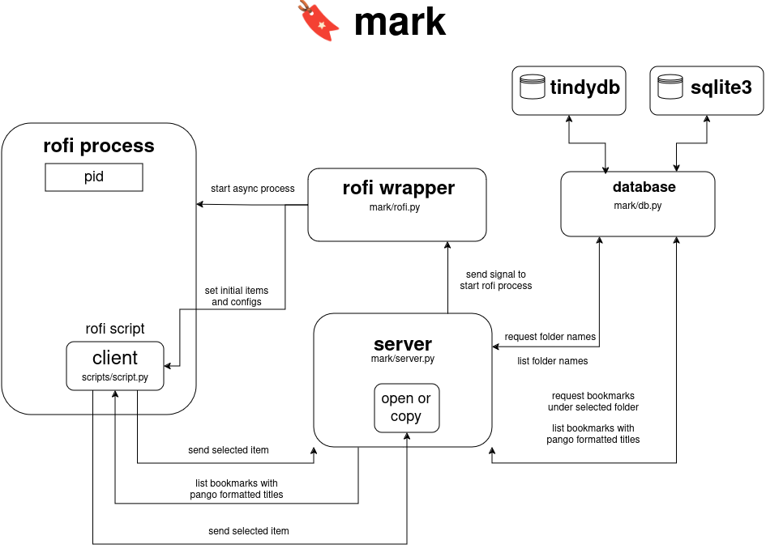

# 🔖 Mark: Centralized Bookmark Management Utility

**Mark** is a centralized bookmark management cli-based utility. It is a successor of bash script I wrote a year ago. Admittedly, it was not the best design nor generic enough to suit different cases.

## Installation

> [!IMPORTANT]
> Make sure that `rofi` is installed on your machine.
> Exception will be raised if it is not installed.

```sh
git clone https://github.com/mohamedrezk122/mark
cd mark
pip3 install -e .
```

## Design Note

Mark utilizes a flat folder hierarchy, meaning you can create as many folders as you like, with each folder containing multiple bookmarks in the following structure: `{"title": title, "url": url}`. While these aren't actual folders or directories, they emulate the folder structure typically found in a browser's bookmark manager. In reality, these "folders" are simply database table names.

This flat hierarchy design is chosen because it simplifies the process of selecting or inserting bookmarks compared to a hierarchical (multi-level) folder structure.

## Usage

### Get a Bookmark

**Command**: 

`mark get --help`

**Description**:

Retrieve a bookmark from the database. A Rofi menu will appear, prompting you to select the folder containing the bookmark. After choosing the folder, the menu will update with a list of bookmarks in that folder. Fuzzy searching is enabled in both steps to help you find the desired entry. The selected bookmark can be handled in one of two ways: **opening** it in the default application (e.g., Firefox) or **copying** the URL to the clipboard. This action is determined by the CLI option `--on-selection`. Below are the CLI options and flags available under the `get` command.

**Options**:

` --on-selection [copy|open]`  
Specifies the action upon selecting a bookmark: either `open` in the default application or `copy` the URL `[default: copy]`.

`--folder-format TEXT`    
Pango formatting string used to style the folder entry in Rofi. The Pango string must include the `$title` placeholder, which will be replaced at runtime. 
`[default: $title/]`

` --entry-format TEXT`    
Pango formatting string used to style the bookmark entry in Rofi. The Pango string must include the `$title` placeholder, which will be replaced at runtime. `[default: $title]`

` --url-meta`   
Uses the URL as a hidden search term to filter bookmarks. (Note: This option name might not be the most descriptive.)

For more about Pango markup formatting, refer to: [PANGO](https://docs.gtk.org/Pango/pango_markup.html)

---

### Insert a Bookmark

**Command**: 

`mark insert --help`

**Description**:

To insert a bookmark, follow these steps:
1. Copy the URL (or file location, etc.) that you want to save (this is crucial).
2. Open the menu (via a keybinding or by running the command).
3. Select the folder where you want to insert the bookmark. You can create a new folder by typing the name and pressing enter.
4. The menu will then prompt you to provide a title for the bookmark. If no title is supplied, the URL will be used as the title.

**Options**:

`--folder-format TEXT`      
Pango formatting string used to style the folder entry in Rofi. The Pango string must include the `$title` placeholder, which will be replaced at runtime. 
`[default: $title/]`

`--infer-title`     
Attempts to infer the title during insertion. If the parser cannot retrieve the title tag or if a timeout occurs, the Rofi menu will continue after folder selection, prompting you to enter a title.

`--no-duplicates`       
If the URL you copied already exists in the selected folder, it will be ignored, and you will not be prompted for a title.

---

### Import file

**Command**: 

`mark import --help`

**Description**:

Import bookmarks from another structured format. Currently, the only supported format is the **Netscape Bookmark HTML format**, which most browsers use for import/export operations.

**Note**:
Browsers support hierarchical folders as opposed to **mark**. To overcome this issue, every bookmark will be inserted to the nearest folder it belongs to. Taking the following structure as an example, `bookmark-1` and `bookmark-2` will be inserted under `folder-2` while `bookmark-3` will be inserted under `folder-1` as expected.

```
├── folder-1
│   ├── folder-2
│   │   ├── bookmark-1
│   │   └── bookmark-2
│   ├── bookmark-3
```

**Options**:

`--format [html|md]`  
Specifies the file format for import and export operations. `[default: html]`

`-o, --output PATH`  
Specifies the output file path. `[default: output]`

`--clean-title`  
Enables title cleaning during import, such as removing unknown characters and normalizing Unicode characters.

`--no-duplicates`  
Prunes duplicate bookmarks during import.

`--start-date [%Y-%m-%d|%Y-%m|%Y]`  
Filters bookmarks starting from the specified date.

`--end-date [%Y-%m-%d|%Y-%m|%Y]`  
Filters bookmarks up to the specified date.

`--date-attr [add|modify]`  
Specifies the date attribute used for filtering, either `add_date` or `last_modified`. `[default: add]`

`--remove-if-empty`  
Removes empty folders that do not contain any bookmarks during import.

---

### Export File

**Command**: 

`mark export --help`

**Description**:

Export bookmarks to various formats. Currently supported formats are:
   - Netscape Bookmark format
   - Markdown format

**Note**:
   **Mark** does not store any metadata about bookmarks, such as `add_date`, `icon_url`, etc., like browsers do. Therefore, any date attribute is set to the time the export operation is executed, and other attributes are set to empty strings.

**Options**:

`--format [html|md]`  
Specifies the file format for import and export operations. `[default: html]`

`-o, --output PATH`  
Specifies the output file path. `[default: output]`

`--heading INTEGER RANGE`  
Specifies the folder heading level used in Markdown export. `[default: 3; 1<=x<=6]`

`--force`  
Forces overwrite of existing files.

---

## How it works

> [!WARNING]
> THIS SECTION IS NOT YET COMPLETE

